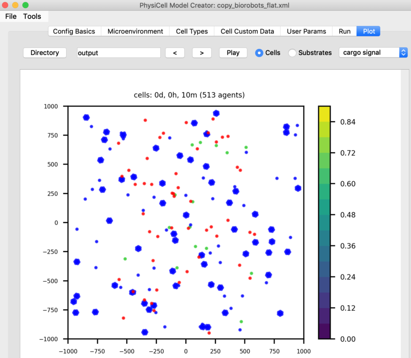
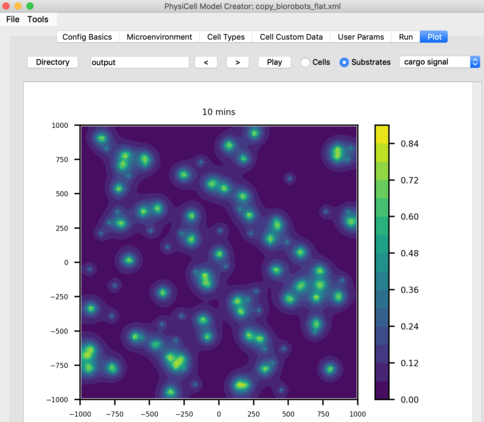

# PhysiCell_Studio

```
cd PhysiCell-model-builder
python bin/gui4xml_with_vis.py --vis
```





On macOS anyway:
```
cd PhysiCell_1.9.1_cmake/cmake_build
cmake -DCMAKE_CXX_COMPILER=g++-11 -DCMAKE_C_COMPILER=gcc-11 ..
make
```

This should create `mymodel` which expects a .xml configuration file to run successfully.
